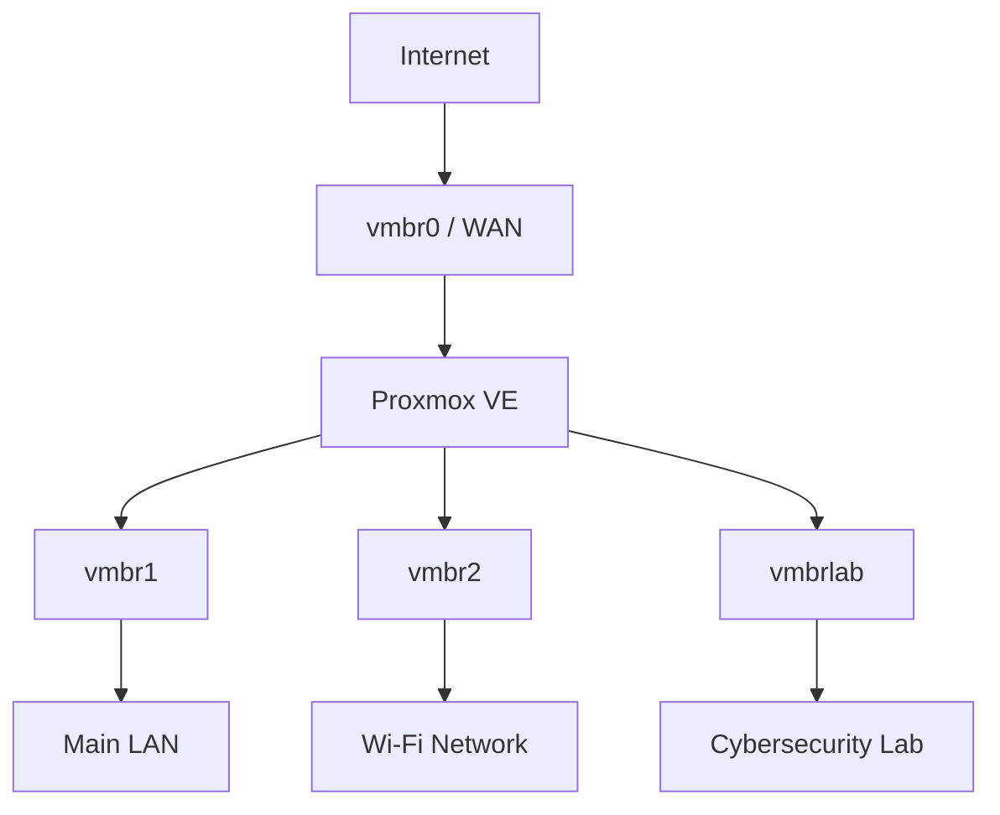

# Proxmox Network Lab

A self-hosted Proxmox VE environment built for learning and experimenting
with virtualization, Linux networking, routing, NAT, network segmentation
and cybersecurity infrastructure.

The Proxmox host acts as both a virtualization platform and a network
gateway for several separated networks.

The goal of this repository is to document the overall network architecture,
configuration and security design of the environment.

Detailed T-Pot honeypot configuration and attack investigations are
documented separately in the **Proxmox T-Pot Honeypot Lab** repository.

---

## Highlights

- Proxmox VE virtualization
- Multiple Linux bridges
- Separate trusted, Wi-Fi and cybersecurity lab networks
- IPv4 routing
- NAT using iptables MASQUERADE
- Stateful firewalling with connection tracking
- Isolated virtual lab network
- Persistent network configuration
- Dedicated T-Pot honeypot environment

---

## Architecture



The Proxmox server provides virtualization, routing and network connectivity
between the different network segments.

The cybersecurity lab is placed on a dedicated virtual-only bridge so that
experimental systems can be separated from trusted internal networks.

---

## Environment

### Proxmox Host

| Component | Value |
|---|---|
| Server | HP ProLiant DL380e G8 |
| CPU | Intel Xeon E5-2450L |
| Hypervisor | Proxmox VE |
| Hostname | `<proxmox-host>` |
| Physical NICs | `eno1` - `eno4` |

### Client

The primary management workstation is an Arch Linux desktop connected to
the main trusted LAN.

```text
Network: <trusted-lan-subnet>
Client:  <trusted-client-ip>
Gateway: <trusted-lan-gateway>
```

---

## Network Overview

| Bridge | Physical NIC | Network | Purpose |
|---|---|---|---|
| `vmbr0` | `eno1` | DHCP / WAN | Upstream Internet |
| `vmbr1` | `eno2` | `<trusted-lan-subnet>` | Main trusted LAN |
| `vmbr2` | `eno3` | `<wifi-subnet>` | Wi-Fi network |
| `vmbrlab` | None | `<lab-subnet>` | Cybersecurity lab |
| - | `eno4` | - | Currently unused |

---

## Network Design

### vmbr0 - WAN

`vmbr0` is connected to the physical interface:

```text
eno1
```

The interface receives its address dynamically from the upstream network.

Its primary purpose is to provide Internet connectivity for the Proxmox host
and selected internal networks.

---

### vmbr1 - Main LAN

`vmbr1` is the primary trusted wired network.

```text
Network: <trusted-lan-subnet>
Gateway: <trusted-lan-gateway>
NIC:     eno2
```

The primary workstation is connected to this network.

Traffic from this network can be routed and NATed through `vmbr0`.

---

### vmbr2 - Wi-Fi Network

`vmbr2` provides a separate network for Wi-Fi connectivity.

```text
Network: <wifi-subnet>
Gateway: <wifi-gateway>
NIC:     eno3
```

This network is kept separate from the main wired LAN at the bridge level.

---

### vmbrlab - Cybersecurity Lab

`vmbrlab` is a virtual-only Proxmox bridge.

```text
Network: <lab-subnet>
Gateway: <lab-gateway>
Physical NIC: None
```

The bridge uses:

```text
bridge-ports none
```

which means that it is not directly attached to a dedicated physical
Ethernet interface.

This network is used for cybersecurity experiments and virtual machines
that should remain separated from the trusted internal networks.

The current T-Pot honeypot VM is hosted on this network at:

```text
<honeypot-ip>
```

---

## Routing

The Proxmox host performs Layer 3 routing between selected networks.

IPv4 forwarding is enabled on the host.

Verification:

```bash
sysctl net.ipv4.ip_forward
```

Expected result:

```text
net.ipv4.ip_forward = 1
```

Routing allows Proxmox to act as the gateway for the internal networks.

---

## Network Address Translation

Private internal networks use NAT when accessing external networks through
`vmbr0`.

Current internal networks include:

```text
<trusted-lan-subnet>
<wifi-subnet>
<lab-subnet>
```

The basic traffic flow is:

```text
Internal network
      |
      v
Proxmox bridge
      |
      v
Proxmox routing
      |
      v
MASQUERADE
      |
      v
vmbr0
      |
      v
Internet
```

Example MASQUERADE rule:

```bash
iptables -t nat -A POSTROUTING \
-s <trusted-lan-subnet> \
-o vmbr0 \
-j MASQUERADE
```

MASQUERADE is useful because the address on `vmbr0` is assigned dynamically.

More detailed routing and NAT documentation is available in:

[Routing and NAT](docs/routing-and-nat.md)

---

## Security Design

Network segmentation is used to separate trusted systems from experimental
cybersecurity workloads.

The main security boundary is between:

```text
Trusted networks

vmbr1
vmbr2

      X

vmbrlab
Cybersecurity Lab
```

New connections originating from the cybersecurity lab toward the trusted
networks are blocked.

Conceptually:

```text
vmbrlab -> vmbr1    DROP
vmbrlab -> vmbr2    DROP
```

Stateful firewalling is used so that response traffic belonging to an
existing permitted connection can still be handled correctly.

Linux connection tracking states such as:

```text
ESTABLISHED
RELATED
```

are used for this purpose.

The security lab can therefore be given controlled connectivity without
giving it unrestricted access to trusted internal systems.

---

## Proxmox Connection Tracking

Proxmox firewall-enabled virtual machines use additional firewall bridge
interfaces such as:

```text
fwbr*
```

During development, connection tracking had to be considered when combining
Proxmox firewall bridges, NAT and forwarded VM traffic.

A connection tracking zone is used for the Proxmox firewall bridges:

```bash
iptables -t raw -I PREROUTING \
-i fwbr+ \
-j CT --zone 1
```

This configuration is documented in more detail in the troubleshooting
notes.

---

## Management

The Proxmox environment is primarily managed from the trusted LAN.

### SSH

Administrative SSH access is available through the trusted network.

Example:

```bash
ssh <admin-user>@<trusted-lan-gateway>
```

Direct root SSH login is disabled.

### Proxmox Web Interface

The Proxmox web interface is accessible from the trusted LAN on:

```text
TCP/8006
```

Example:

```text
https://<trusted-lan-gateway>:8006
```

Management services are not intentionally exposed as honeypot services.

---

## Validation

The network configuration has been tested using several layers of
verification.

Examples include:

```bash
ip -br addr
ip route
bridge link
ifquery --check -a
```

Firewall and NAT configuration can be inspected with:

```bash
iptables -L -v -n
iptables -t nat -L -v -n
iptables -t raw -L -v -n
```

Testing has included:

- Interface configuration verification
- Gateway connectivity
- Internet connectivity
- NAT verification
- Firewall counter verification
- Trusted LAN isolation
- Cybersecurity lab isolation
- Connection tracking validation
- Configuration persistence testing

---

## Documentation

Detailed technical documentation is stored in the `docs` directory.

| Document | Purpose |
|---|---|
| [Architecture](docs/architecture.md) | Network design and segmentation |
| [Network Configuration](docs/network-configuration.md) | Proxmox bridge configuration |
| [Routing and NAT](docs/routing-and-nat.md) | IPv4 forwarding and NAT |
| [Security](docs/security.md) | Firewall and isolation design |
| [Troubleshooting](docs/troubleshooting.md) | Problems, investigation and fixes |
| [Implementation Notes](docs/implementation-notes.md) | Detailed chronological notes |

Example configuration files are stored under:

```text
configs/
```

These files are intended as sanitized reference configurations rather than
automatic deployment scripts.

---

## Related Project

The isolated `vmbrlab` network hosts my T-Pot honeypot environment.

The honeypot project expands the infrastructure with:

- Internet-facing honeypot services
- DNAT
- Dedicated ingress filtering
- Restricted outbound traffic
- Cowrie
- Dionaea
- Suricata
- Elasticsearch / Kibana
- Attack investigations
- IOC extraction
- Malware static-analysis workflow

The implementation and attack investigations are documented separately in:

[**Proxmox T-Pot Honeypot Lab**](https://github.com/KJabaX/Proxmox-TPot-Honeypot-Lab)
---

## Repository Structure

```text
Proxmox-Network/
│
├── README.md
├── CHANGELOG.md
│
├── docs/
│   ├── architecture.md
│   ├── network-configuration.md
│   ├── routing-and-nat.md
│   ├── security.md
│   ├── troubleshooting.md
│   └── implementation-notes.md
│
└── configs/
    ├── interfaces.example
    └── sysctl.example
```

---

## Future Development

Possible future improvements include:

- Additional network segmentation
- VLAN support
- Improved firewall rule organization
- Dedicated management network
- Infrastructure automation
- Automated configuration backups
- Improved network monitoring
- Additional isolated cybersecurity workloads

Major architecture changes are documented in:

[CHANGELOG.md](CHANGELOG.md)
