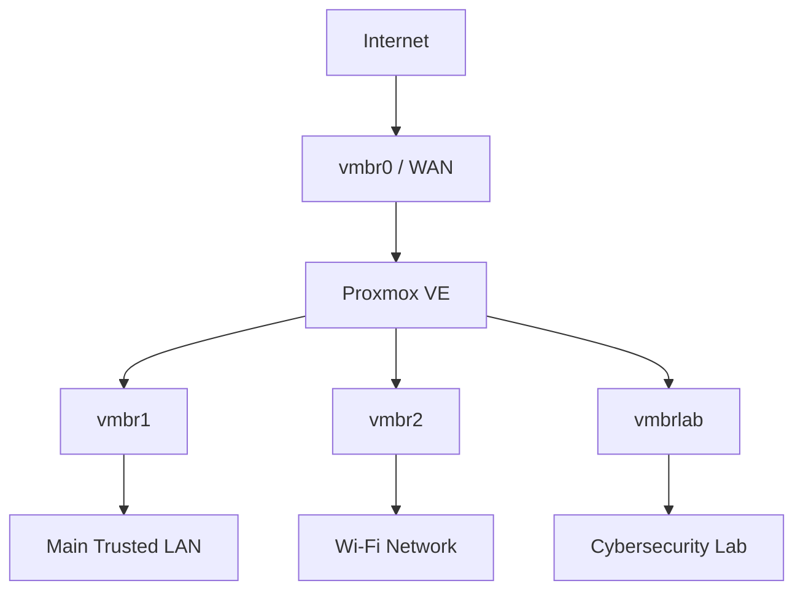

# Network Architecture

This document describes the network architecture of a self-hosted
Proxmox VE lab environment. Environment-specific identifiers and addresses
are intentionally sanitized in this public version.

The environment was designed to provide separate networks for trusted
devices, Wi-Fi connectivity and isolated cybersecurity workloads while
allowing the Proxmox host to provide routing and Internet connectivity
where required.

---

## Design Goals

The main goals of the network design are:

- Separate trusted systems from experimental cybersecurity workloads
- Provide dedicated network segments for different purposes
- Use Proxmox as both a virtualization platform and network gateway
- Provide controlled Internet access to internal networks
- Keep cybersecurity lab systems isolated from trusted networks
- Allow the environment to be expanded with additional virtual machines,
  VLANs and security projects in the future
- Keep management services separate from Internet-facing laboratory services

---

## Physical Server

The environment runs on an HP ProLiant DL380e G8 server.

The server contains four physical Ethernet interfaces:

| Interface | Purpose |
|---|---|
| `eno1` | Upstream / WAN |
| `eno2` | Main trusted LAN |
| `eno3` | Wi-Fi network |
| `eno4` | Currently unused / reserved |

Proxmox VE provides the virtualization and networking layer.

---

## High-Level Architecture



The Proxmox host sits between the upstream network and the internal
network segments.

---

## Network Segments

### vmbr0 - WAN

`vmbr0` is the upstream-facing Proxmox bridge.

Physical interface:

```text
eno1
```

Address assignment:

```text
DHCP
```

Purpose:

- Proxmox Internet connectivity
- Upstream route for internal networks
- NAT egress interface
- Entry point for selected externally forwarded laboratory traffic

The WAN address is dynamically assigned by the upstream network.

---

### vmbr1 - Main Trusted LAN

`vmbr1` is the primary wired network.

```text
Network: <trusted-lan-subnet>
Gateway: <trusted-lan-gateway>
NIC:     eno2
```

This network contains trusted devices such as the primary management
workstation.

Example workstation:

```text
<trusted-client-ip>
```

The network uses the Proxmox host as its gateway.

---

### vmbr2 - Wi-Fi Network

`vmbr2` provides a separate network for Wi-Fi connectivity.

```text
Network: <wifi-subnet>
Gateway: <wifi-gateway>
NIC:     eno3
```

The network is separated from the main wired LAN at the Proxmox bridge
level.

This also makes it possible to apply different routing and firewall
policies to Wi-Fi devices in the future.

---

### vmbrlab - Cybersecurity Lab

`vmbrlab` is a virtual-only Proxmox bridge used for cybersecurity
experiments.

```text
Network: <lab-subnet>
Gateway: <lab-gateway>
Physical NIC: None
```

The bridge is configured with:

```text
bridge-ports none
```

Unlike `vmbr1` and `vmbr2`, the lab bridge is not directly connected to
a dedicated physical Ethernet interface.

Virtual machines connected to this network therefore communicate through
the Proxmox host.

---

## Cybersecurity Lab Isolation

The cybersecurity lab is intentionally separated from the trusted
networks.

Conceptually:

```text
                 Trusted networks

                vmbr1      vmbr2
                  ^          ^
                  |          |
                  X          X
                  |          |
                     vmbrlab
                        |
                        v
                Cybersecurity Lab
```

New connections originating from `vmbrlab` toward trusted networks are
blocked by firewall policy.

```text
vmbrlab -> vmbr1    DROP
vmbrlab -> vmbr2    DROP
```

This prevents experimental systems from freely initiating connections
toward trusted internal devices.

Stateful firewalling can still allow response traffic belonging to
connections that were already permitted.

---

## Routing Model

The Proxmox host performs Layer 3 routing for the internal networks.

The internal networks use the Proxmox bridge addresses as their gateways:

| Network | Gateway |
|---|---|
| `<trusted-lan-subnet>` | `<trusted-lan-gateway>` |
| `<wifi-subnet>` | `<wifi-gateway>` |
| `<lab-subnet>` | `<lab-gateway>` |

IPv4 forwarding is enabled on the Proxmox host.

Traffic between networks is then controlled using firewall policy rather
than allowing unrestricted routing.

---

## NAT Model

Private internal networks access the Internet through `vmbr0`.

The basic traffic path is:

```text
Internal VM / Device
        |
        v
Internal bridge
        |
        v
Proxmox routing
        |
        v
NAT / MASQUERADE
        |
        v
vmbr0
        |
        v
Internet
```

The use of separate routing and firewall rules allows Internet
connectivity to be provided without automatically allowing communication
between all internal networks.

---

## Management Network

Administrative access to Proxmox is primarily performed from the trusted
`vmbr1` network.

Examples include:

```text
SSH
Proxmox Web Interface
```

Management services are not intentionally exposed as cybersecurity lab
services.

The separation between management and lab traffic is an important part
of the design.

---

## T-Pot Integration

The current cybersecurity lab hosts a T-Pot honeypot VM.

```text
T-Pot VM: <honeypot-ip>
Network:  <lab-subnet>
Gateway:  <lab-gateway>
Bridge:   vmbrlab
```

The purpose of this repository is to document the underlying Proxmox
network infrastructure.

Detailed T-Pot configuration, Internet-facing honeypot services, DNAT,
egress filtering and attack investigations are maintained in the
separate **Proxmox T-Pot Honeypot Lab** repository.

---

## Design Philosophy

The network follows a simple principle:

```text
Separate first.
Allow only what is required.
Verify the result.
```

Instead of placing all virtual machines on the same bridge, different
workloads are placed into dedicated network segments.

This makes the environment easier to understand, troubleshoot and extend
while also providing clearer security boundaries.

---

## Future Expansion

The architecture is designed so that additional networks can be added
without redesigning the entire environment.

Possible future additions include:

- VLAN-based segmentation
- Dedicated management network
- Additional isolated laboratory networks
- Monitoring network
- SIEM infrastructure
- Infrastructure automation
- Configuration backup and recovery
- Additional firewall zones

Any major architecture changes will be recorded in the repository
`CHANGELOG.md`.
